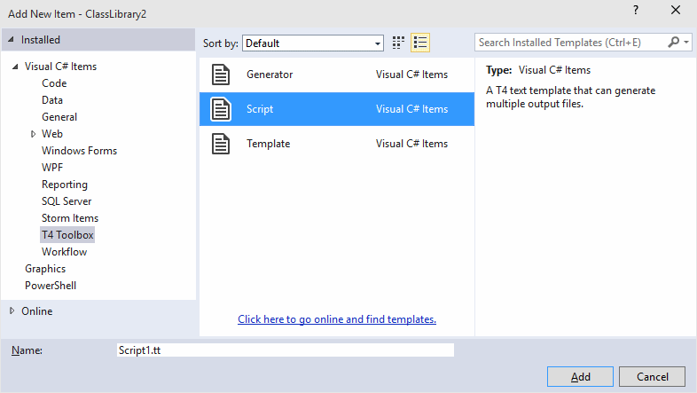
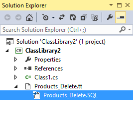

# Creating a Simple Code Generation Script

- Create a new _Class Library_ project in Visual Studio.
- Add a new _Script_ file from the _T4 Toolbox_ folder to the project.



- Enter `Products_Delete.tt` as the item name and click the _Add_ button.
- Double-click the new file in the _Solution Explorer_. You will see the following text in the text editor.

```
<#@ template language="C#" hostspecific="True" debug="True" #>
<#@ output extension="txt" #>
<#@ include file="T4Toolbox.tt" #>
<#
// <copyright file="Products_Delete.tt" company="Your Company">
//  Copyright @ Your Company. All Rights Reserved.
// </copyright>  

#>
```

This file is a Text Template, also known as a T4 Template. Text Templates are code generators that can produce any text files, 
including C#, Visual Basic, SQL and XML. Text Templates use ASP.NET-like syntax and consist of text blocks, code blocks and 
directives. Text blocks are blocks of text in the template that are copied to the output file as is. Directives provide instructions
to the text templating Engine on how to process the template. In the example above, the `template` directive tells the T4 Engine which
language the template uses in its code blocks. Code blocks contain C# or Visual Basic code that runs during template transformation and 
allow making generated output dynamic.

## Generating Static Output

We will start implementing the code generator by hard-coding a DELETE stored procedure for the Products table of the Northwind database.

- Change `Products_Delete.tt` to look like so.

```
<#@ output extension="SQL" #>
create procedure Products_Delete
    @ProductID int
as
    delete from Products
    where ProductID = @ProductID
```

When you save a .tt file, Visual Studio transforms the text template and generates the output file. In the _Solution Explorer_, 
the output file appears nested under the the template file. If you are using Visual Basic, you will need to click the 
_Show All Files_ button in the toolbar of the _Solution Explorer_ to see the output file.



You can also transform the template by right-clicking it in the _Solution Explorer_ and selecting _Run Custom Tool_ from 
the context menu. 

The template above contains a processing directive, `output`, and a text block. If you double-click the generated file, 
its contents will be identical to the contents of the text block and will look like so.

```
create procedure Products_Delete
    @ProductID int
as
    delete from Products
    where ProductID = @ProductID
```

## Adding .NET code to text template

At this point, the generated output is static, which is not any better than coding this stored procedure by hand. Instead, 
we can generate it dynamically, using the database schema information provided by the SQL Server.

- Change `Products_Delete.tt` to look like so

```
<#@ template language="C#" #>
<#@ output extension="SQL" #>
<#@ assembly name="Microsoft.SqlServer.ConnectionInfo" #>
<#@ assembly name="Microsoft.SqlServer.Management.Sdk.Sfc" #>
<#@ assembly name="Microsoft.SqlServer.Smo" #>
<#@ import namespace="Microsoft.SqlServer.Management.Smo" #>
<#
    var server = new Server("(localdb)\\v11.0");
    var database = new Database(server, "Northwind");
    var table = new Table(database, "Products");
    table.Refresh();
#>
create procedure Products_Delete
    @ProductID int
as
    delete from Products
    where ProductID = @ProductID
```

This code uses a `template` directive to specify the .NET language (C# or VB) this template uses in its code blocks. 
The template also contains a _statement block_ which is defined using special markers - `<#` and `#>`. This block uses 
SQL Server Management Objects (SMO) to retrieve metadata information about the `Products` table from the `Northwind` database 
running on the `(localdb)\\v11.0` instance of SQL server. This API (SMO) is defined in a .NET assembly, 
_Microsoft.SqlServer.Smo_ which is installed in the Global Assembly Cache (GAC) by the SQL Server setup program. 
In order to use this API, the template uses an `assembly` directive to reference the _assembly_ where it is defined and 
an `import` directive to specify the _namespace_ where `Server`, `Database` and `Table` types are defined. The `import` 
directive is similar to the _imports_ statement in Visual Basic and the _using_ statement in C#. It allows the template
to use types from the specified namespace without having to fully-qualify their names.

## Making Code Generation Dynamic

Having the metadata information about the target table, we can now generate the DELETE stored procedure for it dynamically.

- Change `Products_Delete.tt` to look like so.

```
<#@ template language="C#" #>
<#@ output extension="SQL" #>
<#@ assembly name="System.Xml" #>
<#@ assembly name="Microsoft.SqlServer.ConnectionInfo" #>
<#@ assembly name="Microsoft.SqlServer.Management.Sdk.Sfc" #>
<#@ assembly name="Microsoft.SqlServer.Smo" #>
<#@ import namespace="Microsoft.SqlServer.Management.Smo" #>
<#
    var server = new Server("(localdb)\\v11.0");
    var database = new Database(server, "Northwind");
    var table = new Table(database, "Products");
    table.Refresh();
#>
create procedure <#= table.Name #>_Delete
<#
    PushIndent("\t");
    foreach (Column column in table.Columns)
    {
        if (column.InPrimaryKey)
            WriteLine("@" + column.Name + " " + column.DataType.Name);
    }
    PopIndent();
#>
as
    delete from <#= table.Name #>
    where
<#
    PushIndent("\t\t");
    foreach (Column column in table.Columns)
    {
        if (column.InPrimaryKey)
            WriteLine(column.Name + " = @" + column.Name);
    }
    PopIndent();
#>    
```

The template now uses _expression_ blocks to dynamically generate the name of the target table in the output file. 
_Expression_ blocks are enclosed by the `<#=` and `#>` markers and can contain any valid programming expression, 
which will be converted to a string and written to the output file. This template also uses additional _statement_ 
blocks to iterate through the list of `table.Columns` and calls the 
[WriteLine](https://msdn.microsoft.com/en-us/library/microsoft.visualstudio.texttemplating.texttransformation.writeline.aspx) 
method to generate the stored procedure parameter declarations and the `where` clause for the `delete` statement based 
on the primary key of the table. The [PushIndent](https://msdn.microsoft.com/en-us/library/microsoft.visualstudio.texttemplating.texttransformation.pushindent.aspx) 
and [PopIndent](https://msdn.microsoft.com/en-us/library/microsoft.visualstudio.texttemplating.texttransformation.popindent.aspx) 
methods are used to make the generated parameter declarations and the where clause easier to read.